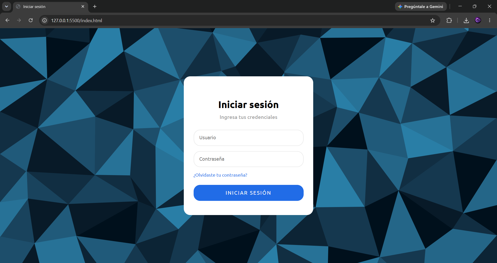

# Login Card

Tarjeta de inicio de sesión responsiva construida con HTML y CSS puro.

## 📋 Descripción

Interfaz de login con diseño centrado tipo "card", animación de fondo y estilos personalizados para inputs, botón y enlace de recuperación de contraseña.

## 🚀 Características

- Diseño responsivo (breakpoint en 500px)
- Tipografía Ubuntu importada desde Google Fonts
- Animación de fondo (`@keyframes rotate`)
- Transiciones suaves en inputs, botón y enlace al pasar el cursor
- Estructura semántica simple y fácil de extender

## 🛠️ Tecnologías

- HTML5
- CSS3 (Grid, `box-sizing`, `@media`, `@keyframes`)

## 📁 Estructura del proyecto

```
├── index.html
├── style.css
└── imagen.svg   # imagen de fondo (agregar en la misma carpeta)
```

## 📦 Instalación y uso

1. Clona o descarga este repositorio.
2. Asegúrate de que el archivo `imagen.svg` esté en la misma carpeta que `style.css`.
3. Abre `index.html` en tu navegador.

```bash
git clone <url-del-repositorio>
cd login-card
```

## 🎨 Personalización

- **Colores**: modifica las variables de color en `.login-form > button` (`#216ce7`) y su estado `:hover` (`#10449A`).
- **Tipografía**: cambia el `font-family` en el selector `body` para usar otra fuente importada.
- **Imagen de fondo**: reemplaza `imagen.svg` por cualquier imagen y ajusta `background-size`/`background-position` según sea necesario.


## 🌐 Pagina
https://dise-o-moderno-pagina-ui-dise-o.vercel.app/

## 📷 Foto
